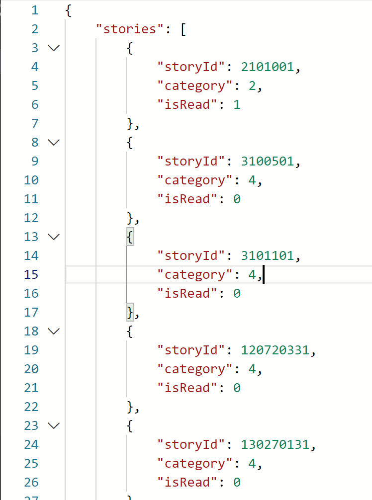

# minashigo-hcg

用 Node 拉取《ミナシゴノシゴトR》剧情资源（剧本、CG、语音）到本地，支持按寝室/场景 ID 拉取、按 manifest 类型批量下载，以及请求加解密等工具。

---

## 使用前请先配置

**请先在项目根目录准备好 config.json（以及需要鉴权的脚本再准备 cert.pem / key.pem），再运行下方脚本。**

### config.json（必配）

所有鉴权与版本统一放在 **config.json**（项目根目录）：

```json
{
  "version": {
    "resourceVersion": "2.7.020",
    "masterVersion": "2.7.02",
    "clientVersion": "2.7.022"
  },
  "token": {
    "dmmId": "...",
    "userId": "...",
    "token": "...",
    "secret": "...",
    "expires": 1773584597
  }
}
```

- **version**：运行 **update-token.bat** 会拉取 getVersion 并更新该段，无需手改。
- **token**：需手动从浏览器抓包获取。打开游戏 → F12开发者工具 Network → 找到 **getDmmAccessToken** 的响应，把响应 JSON 填进 `config.token`。

### cert.pem / key.pem（按需）

使用 **fetch-resources.bat**、**start.bat**、**fetch-user-data.bat** 等会请求游戏服务器的脚本时，需在项目根目录（或父目录）放置 **cert.pem** 与 **key.pem**（客户端证书）。仅用 update-token、update-manifest、decrypt-body 等可不配。

---

## 功能概览

| 功能 | 说明 |
|------|------|
| **按场景拉资源** | 输入寝室/场景 ID（如 `122810112`），拉取该场景的剧本、CG、语音到 `output/<场景ID>/` |
| **更新 manifest** | 从 CDN 拉 resource.json 解密得到 result.json，供场景列表、按类型导出等使用 |
| **按类型批量下载** | 按 manifest 或清单 JSON（cg / audio / episode_story / stand / bgm 等）批量下载到本地 |
| **用户数据** | 请求 getUserData 接口，解密后保存为 JSON |
| **加解密工具** | 用 config 中的 token 解密请求/响应中的 `data` 密文 |

---

## 环境

- **Node.js**：`npm i` 安装依赖后即可运行所有脚本。若用 **download.py** 则需 Python 与 `pip install -r requirements.txt`（或已安装 `requests`），否则用 **download.js** 即可。

---

## 脚本与用法

### 一、配置与 Manifest

| 脚本 | 作用 | 用法 |
|------|------|------|
| **update-token.bat** | 更新 config 中的版本（getVersion） | 双击或 `node update-token.js` |
| **update-manifest.bat** | 拉取 manifest，解密后写入 **result.json**（无需 token/cert） | 双击或 `node update-manifest.js` |
| **start.bat** | 跑 index.js：拉 result.json，并拉角色 CG 清单写入 **cg.json**（需 token + cert） | 双击或 `npm start` / `node index.js` |

### 二、按场景拉资源（剧本 + CG + 语音）

| 脚本 | 作用 | 用法 |
|------|------|------|
| **fetch-resources.bat** | 按寝室/场景 ID 拉取该场景的剧本、图片、语音到 `output/<场景ID>/` | 双击后输入场景 ID（如 `122810112`），或命令行：`fetch-resources.bat 122810112`，可加 `--cg` 等 |

不传场景 ID 时需先有 **result.json**（运行 update-manifest.bat 或 start.bat），脚本会从 manifest 解析场景列表再批量拉。

### 三、按类型批量下载

| 脚本 | 作用 | 用法 |
|------|------|------|
| **download.js** | 按类型读取清单 JSON，将未下载的项按 URL 拉到指定目录 | `node download.js [类型]`，类型：`cg` \| `audio` \| `script` \| `episode_story` \| `stand` \| `bgm` \| `story_voice`，默认 `cg` |
| **get-resource-by-manifest.js** | 从 result.json 按类型导出清单（path + URL） | `node get-resource-by-manifest.js list <类型>`，如 `list episode_story`，生成 `manifest_<类型>.json` |

清单来源：**audio / script / cg** 来自 **start.bat**；**episode_story / stand / bgm** 来自 `get-resource-by-manifest.js list <类型>`。有 Python 也可用 `download.py`，与 download.js 行为一致。

### 四、工具

| 脚本 | 作用 | 用法 |
|------|------|------|
| **decrypt-body.bat** | 用 config 中的 token 解密请求/响应里的 Base64 密文 | 双击后粘贴密文，或：`decrypt-body.bat "U2FsdGVkX19..."`；对应脚本：`node decrypt-body.js "<密文>"` |
| **fetch-user-data.bat** | 请求 getUserData，解密响应并保存为 JSON | 双击或 `fetch-user-data.bat`，默认写入 **user-data.json**；可指定路径：`fetch-user-data.bat my.json`，对应脚本：`node fetch-user-data.js [输出路径]`<br /> |

user-data.json 的内容为你所拥有的寝室id



---

## 输出与依赖关系简表

| 文件 | 来源 |
|------|------|
| result.json | update-manifest.bat 或 start.bat |
| cg.json / audio.json / script.json | start.bat（index.js） |
| output/\<场景ID\>/* | fetch-resources.bat |
| user-data.json | fetch-user-data.bat |
| manifest_\<类型\>.json | get-resource-by-manifest.js list \<类型\> |

需要鉴权（config.token + cert.pem/key.pem）的脚本：start.bat、fetch-resources.bat、fetch-user-data.bat。  
仅需 result.json 或清单 JSON 的：download.js、get-resource-by-manifest.js。
